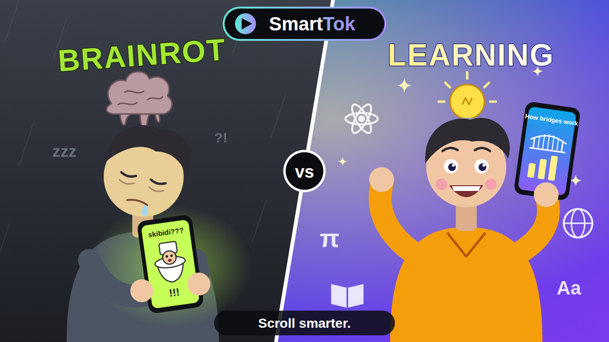
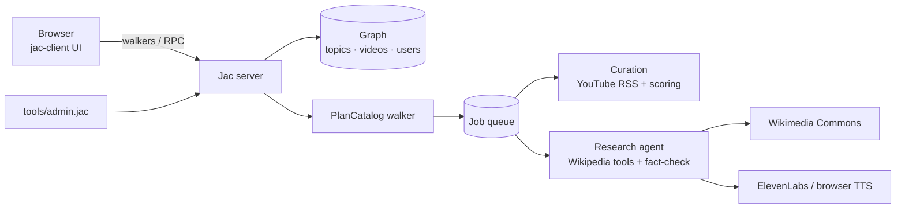

# SmartTok



**Scroll smarter.** SmartTok is a TikTok-style vertical video feed where every video is worth your
time: science, engineering, history, languages, math, DIY and news from multiple outlets. It is a
full-stack app written in [Jac](https://www.jaseci.org/) (server, graph data model, AI agents and
the web UI).

## Features

- **Swipe feed**: full-screen vertical feed with snap scrolling, likes, saves, share, "not useful",
  a Sources sheet and a plain-language "why am I seeing this?".
- **Two kinds of content**
  - **Curated**: YouTube Shorts from ~60 hand-picked educational channels, discovered through
    public RSS feeds (no API key) and scored for quality (LLM when configured, heuristics otherwise).
    Embeds are shown in a framed layout so YouTube's own controls stay visible and usable.
  - **Generated**: SmartTok's own ~60 s explainers. A research agent reads Wikipedia, writes a
    script, fact-checks each claim against what it read and revises before publishing. Videos are
    scene manifests rendered in the browser (templated SVG/HTML scenes + freely licensed Wikimedia
    images) with ElevenLabs narration or the browser's built-in voice.
- **Anti-brainrot by design**: ranking favours quality, interest and topic variety over watch time;
  daily goals, session check-ins, recall quizzes and a "take a break" screen.
- **Personalised without sign-up**: each browser gets a guest account automatically.
- **Admin tooling**: catalog planner walker + job queue, review queue, re-scoring from user signals,
  all driven by a CLI suitable for cron.

## How it works



- The catalog (topics, videos, channels) lives on the shared graph root; each user has a `Profile`
  node with `Engaged` edges to the videos they interacted with.
- The feed is the `LoadFeed` walker: it walks topics → videos, scores each one and reports a ranked,
  diversified page.
- AI runs only on the server (never in the browser) and only for background/admin work. See
  [plan/](plan/README.md) for the full architecture notes.

## Quick start

Requires Python 3.12+ and Node.js 18+.

```bash
git clone git@github.com:pringithub/anti-brainrot-tok.git
cd anti-brainrot-tok

python3.12 -m venv .venv && source .venv/bin/activate   # or: uv venv -p 3.12 .venv
pip install jaclang jac-client byllm requests defusedxml
jac install                                             # project Python + npm dependencies

export ABT_ADMIN_KEY=choose-a-long-random-string
jac start --dev main.jac
```

`jac start --dev` prints two URLs: the **App** (open this) and the **API**. In a second terminal,
seed the catalog:

```bash
source .venv/bin/activate
export ABT_ADMIN_KEY=choose-a-long-random-string ABT_API=http://localhost:8001   # the printed API URL
jac run tools/admin.jac bootstrap        # topics, channels, 3 editorial seed videos
jac run tools/admin.jac curate 6         # pull up to 6 new Shorts per channel
```

Open the App URL, tap **Tap to start**, pick some topics and scroll.

## Configuration

| Variable | Purpose | Default |
|---|---|---|
| `ABT_ADMIN_KEY` | Enables admin endpoints/CLI (≥ 12 chars) | admin disabled |
| `OPENAI_API_KEY` / `ANTHROPIC_API_KEY` / `GEMINI_API_KEY` … | Turns on LLM scoring, planning and the research agent | heuristics only |
| `ABT_LLM_MODEL` | Model name passed to byllm/LiteLLM | `gpt-4o-mini` |
| `ELEVENLABS_API_KEY` | Narration for generated videos | browser speech |
| `ELEVENLABS_VOICE_ID` / `ELEVENLABS_MODEL_ID` | Voice and model | `JBFqnCBsd6RMkjVDRZzb` / `eleven_flash_v2_5` |
| `ABT_API` | Server URL used by the admin CLI | `http://localhost:8000` |
| `ABT_MEDIA_DIR` | Where narration mp3s are written (served at `/static/media/`) | `assets/media` |

## Admin CLI

```bash
jac run tools/admin.jac <command>
```

| Command | What it does |
|---|---|
| `stats` | Catalog counts, LLM/TTS status, queued jobs |
| `bootstrap [--no-seeds]` | Create topics and channels (+ seed videos) |
| `curate [n] [channel]` | Fetch and score new Shorts |
| `plan [target_live] [max_new]` | Run the `PlanCatalog` walker to queue curate/generate jobs |
| `jobs [status]` / `run-jobs [n]` | List / process queued jobs |
| `generate "<subject>" <topic>` | Research agent → new generated video (needs an LLM key) |
| `review [status]`, `approve <id>`, `reject <id>` | Human review queue |
| `rescore` | Fold user signals into stats; demote videos users flag |
| `block "<channel name>"` | Stop curating a channel |

Current-events videos always land in the review queue first.

## Project layout

```
main.jac                 entry: registers server endpoints, mounts the client app
services/                server (.sv.jac)
  catalog.sv.jac         graph model, taxonomy, seed channels, view models
  feed.sv.jac            LoadFeed walker + user interaction endpoints
  curation.sv.jac        YouTube RSS discovery and scoring
  generation.sv.jac      scene manifests, Wikimedia images, TTS
  research.sv.jac        research agent (byllm tools) + fact-check/revise loop
  planner.sv.jac         PlanCatalog walker + job worker
  ai.sv.jac              LLM functions (by llm) and heuristic fallbacks
  admin.sv.jac           admin endpoints
  seeds.sv.jac           hand-written seed videos
components/              client UI (.cl.jac)
styles/global.css        styles
tools/admin.jac          admin CLI
tests/agents_tests.jac   offline tests (MockLLM, no network)
plan/                    architecture and roadmap notes
```

## Development

```bash
jac script check   # type-check every project file
jac script test    # offline tests (agents, planner, helpers)
```

## Deployment notes

SmartTok needs a running Jac server (graph database, auth, background jobs), so static hosts like
GitHub Pages won't work. Any host that can run `jac start main.jac` with persistent storage,
outbound internet access and environment variables will.

## Status

This is an MVP. Not built yet: a curator agent that proposes new channels, a multi-source balance
agent for current events, budget guardrails, search and production deployment. See
[plan/07-roadmap.md](plan/07-roadmap.md).
