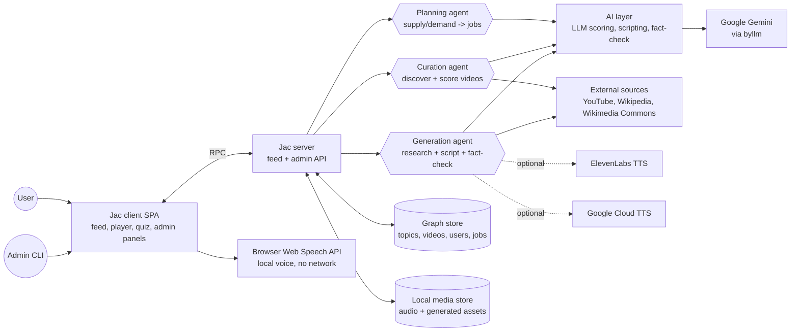
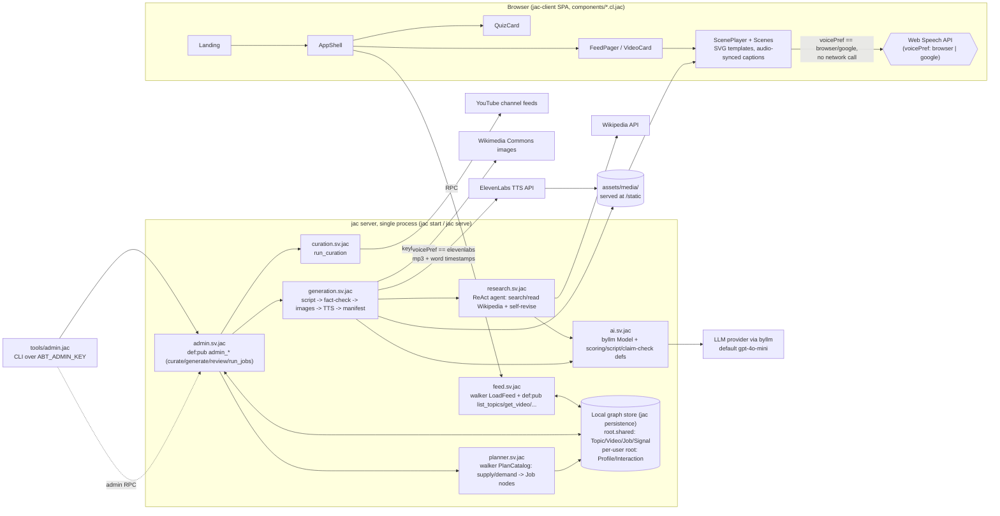

# 01 — System Architecture

> Section 1 reflects the actual implementation as of 2026-09; the rest of this
> document (sections 2-6) is the original design plan and has drifted from
> what's built — see the "Plan vs. reality" note after the diagram.

## 1. High-level view



### Detailed view



### Plan vs. reality (what changed since the original design)

- **No MongoDB/Redis/object storage.** The project uses jac's built-in local
  graph persistence and files under `assets/` served at `/static/...` — no
  Mongo, Redis, R2/S3/MinIO, or CDN were introduced.
- **No separate worker processes or `pipelines/`/`walkers/`/`ai/` dirs.**
  Everything lives in `services/*.sv.jac`. Curation and generation run
  synchronously inside the same server process, triggered either directly
  (`admin_curate`/`admin_generate`) or via a `Job` queue (graph nodes) that
  `planner.sv.jac`'s `PlanCatalog` walker fills and `admin_run_jobs` drains —
  there's no cron/systemd-timer/k8s CronJob yet.
- **Most endpoints are plain `def:pub` functions, not walkers.** Only
  `LoadFeed` (feed.sv.jac) and `PlanCatalog` (planner.sv.jac) are actual
  `walker:pub` — admin/curation/generation/scoring are ordinary functions
  called over RPC.
- **Generation is a Wikipedia-grounded ReAct research agent**
  (`research.sv.jac`), not a generic "sources -> LLM" step: the agent
  searches/reads Wikipedia itself via tool calls, and citations + fact-check
  are restricted to articles it actually read, with a self-revision loop for
  unsupported claims.
- **TTS has three user-selectable voice preferences**, only one of which
  touches a server/API at all: `browser` and `google` both play locally via
  the browser's native Web Speech API (`speechSynthesis`/`SpeechSynthesisUtterance`
  in `ScenePlayer.cl.jac`) — `google` just filters `getVoices()` for a
  Google-branded system voice, it does **not** call any Google Cloud API;
  `elevenlabs` calls the ElevenLabs TTS API server-side (`generation.sv.jac`)
  and caches an mp3 + word-level timestamps in `assets/media` for
  caption/scene sync. ElevenLabs requires `ELEVENLABS_API_KEY`
  (`elevenlabs_enabled()`) and is not the primary path assumed in section 2/3.
- **Frontend is a flat `components/*.cl.jac` dir** (`AppShell`, `Landing`,
  `FeedPager`, `VideoCard`, `ScenePlayer`, `Scenes`, `QuizCard`, `Panels`),
  not the nested `client/{feed,players,scenes}/` layout in section 4, and
  there is no client-side multi-page router beyond `/` (Landing) and `/app`
  (AppShell) in `main.jac`.
- **No MP4 export/ffmpeg pipeline exists** — everything renders as a JSON
  scene manifest played live in the browser.

## 2. Stack

| Layer | Choice | Why |
|-------|--------|-----|
| Language | **Jac** (`jaclang`) | Requested; object-spatial model fits a social/interest graph |
| Frontend | **jac-client** (JSX-like components in Jac, compiled to a React SPA) | Single language front-to-back |
| API | **`jac serve`** (jac-cloud / jac-scale) | Walkers become authenticated REST endpoints; graph auto-persisted |
| Persistence | MongoDB (jac persistence backend) + Redis (cache/sessions) | Default for jac serve |
| AI | **byllm** (`by llm()`, `sem` strings) with a cheap default model, stronger model only where needed | Typed structured outputs without hand-written prompt parsing |
| TTS | **ElevenLabs** (`/v1/text-to-speech/{voice}/with-timestamps`) | Returns character-level alignment → free captions + scene sync |
| Media storage | Cloudflare R2 (zero egress) or S3; MinIO locally | Cheap static delivery |
| Optional render | ffmpeg (already on dev box) | Only for MP4 export/share |
| Python interop | Jac imports Python packages directly (`httpx`, `feedparser`, `yt-dlp` for **metadata/captions only**) | Reuse mature libs |

## 3. Components

### 3.1 Frontend (jac-client)
- `App` → router: `/` (For You), `/following`, `/topic/:slug`, `/v/:id`, `/saved`, `/profile`, `/admin/review`.
- `FeedPager` — vertical snap-scroll container, keeps 3 items mounted (prev/current/next), preloads next 2.
- `VideoCard` — dispatches to `EmbedPlayer` (curated) or `ScenePlayer` (generated).
- `ScenePlayer` — plays narration `<audio>`, uses word timestamps to switch scenes and render captions; scenes are SVG templates or images with CSS Ken-Burns/transition animations.
- `ActionRail` — like, save, share, "sources", "why this?", "not useful".
- `QuizCard` — occasional recall card inserted into the feed.
- `SessionCoach` — soft check-in after N minutes / N videos.

### 3.2 API server (walkers)
Walkers are the API. See [02-data-model.md](02-data-model.md) for the list. Stateless; horizontal scaling behind a load balancer.

### 3.3 Background workers
Separate processes (same codebase) run on a schedule (systemd timers / cron / k8s CronJob):
- `pipelines/curate.jac` — hourly discovery + vetting batch.
- `pipelines/generate.jac` — daily topic-gap + current-events batch; also consumes an on-demand queue (admin "generate about X").
- `pipelines/rescore.jac` — nightly: decay freshness, recompute quality from engagement signals, prune dead embeds.

A simple job queue is a `Job` node in the graph (status: queued/running/done/failed) — avoids adding Celery/RabbitMQ early. Swap to a real queue if throughput demands.

### 3.4 Admin / review
Human-in-the-loop for (a) current-events generated videos before publish, (b) borderline curated scores. Walkers gated by an `is_admin` flag on the user node.

## 4. Proposed repo layout

```
anti-brainrot-tok/
├── jac.toml                    # project + plugin config (jac-client, byllm)
├── main.jac                    # entry: serves walkers + client app
├── models/
│   ├── nodes.jac               # User, Topic, Video, Source, Creator, Job, Quiz...
│   ├── edges.jac               # Watched, Liked, Saved, InTopic, Follows...
│   └── types.jac               # obj types: Script, Scene, QualityScore, Citation...
├── walkers/
│   ├── feed.jac                # get_feed, get_video, get_topic_feed
│   ├── interact.jac            # log_view, like, save, skip, report, answer_quiz
│   ├── user.jac                # onboarding, follow_topic, prefs
│   └── admin.jac               # review_queue, approve, reject, enqueue_generation
├── ai/
│   ├── scoring.jac             # by llm() quality/bias/topic classification
│   ├── scripting.jac           # by llm() script + scene-param generation
│   └── factcheck.jac           # by llm() claim verification vs retrieved sources
├── services/                   # thin clients over external APIs
│   ├── youtube.jac
│   ├── sources.jac             # Vimeo / TED-Ed / NASA / IA adapters
│   ├── news.jac                # RSS + GDELT
│   ├── images.jac              # Wikimedia / Openverse / NASA / LoC search + license filter
│   ├── elevenlabs.jac
│   └── storage.jac             # R2/S3 put/get, content-hash keys
├── pipelines/
│   ├── curate.jac
│   ├── generate.jac
│   └── rescore.jac
├── client/                     # jac-client components
│   ├── app.jac
│   ├── feed/                   # FeedPager, VideoCard, ActionRail
│   ├── players/                # EmbedPlayer, ScenePlayer, CaptionTrack
│   └── scenes/                 # SVG template renderers (TitleCard, Timeline, MapPin, ...)
├── svg_templates/              # canonical SVG template definitions + JSON param schemas
├── scripts/export_mp4.py       # optional ffmpeg export
└── tests/
```

## 5. Deployment

- **Dev**: `docker compose` with MongoDB, Redis, MinIO; `jac serve main.jac`; workers via `jac run`.
- **Prod (small)**: one container for API (+ static client build), one for workers, managed MongoDB (Atlas free/low tier), Redis, R2 + CDN. Scale API horizontally; workers are cron-driven and idempotent.
- **Secrets**: `YOUTUBE_API_KEY`, `ELEVENLABS_API_KEY`, LLM key(s), storage creds — env vars / secret manager only, never in the graph or client bundle.

## 6. Cross-cutting concerns

- **Auth**: jac serve built-in user auth (email/password → token); anonymous browsing allowed with a device-scoped guest user so the feed personalises before sign-up.
- **Security**: all external URLs rendered only through an allowlist of embed hosts; SVG templates are ours (LLM supplies text params only, escaped) → no SVG/XSS injection; CSP restricting `frame-src` to embed providers; rate-limit interaction walkers.
- **Observability**: structured logs per pipeline run (items discovered/accepted/rejected, tokens used, TTS chars used, cost estimate) stored as `PipelineRun` nodes + exported to logs.
- **Idempotency**: every external item keyed by `(source, external_id)`; every generated asset keyed by content hash.
