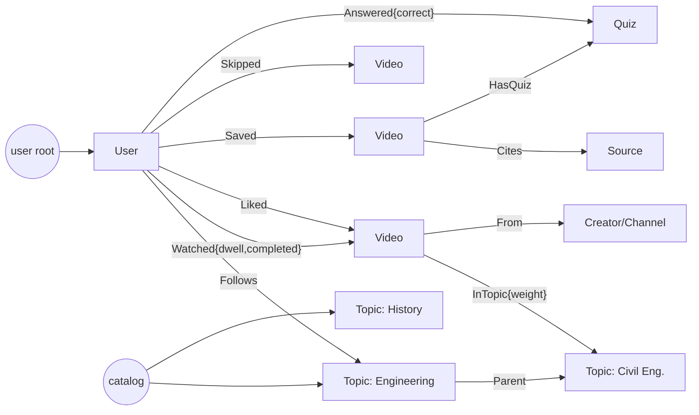

# 02 — Data Model & API

Jac's object-spatial model stores everything as a graph rooted at each user's `root` plus a shared
global catalog. Walkers traverse it and double as REST endpoints under `jac serve`.

## 1. Graph shape



## 2. Nodes (illustrative Jac)

```jac
node User {
    has handle: str;
    has is_admin: bool = False;
    has is_guest: bool = True;
    has prefs: dict = {};            # daily_minutes_goal, checkin_every_n, languages
    has interest_vec: dict = {};     # topic_slug -> float, updated online
}

node Topic {
    has slug: str;                   # "engineering/civil"
    has name: str;
    has is_current_events: bool = False;
}

node Video {
    has kind: str;                   # "curated" | "generated"
    has status: str = "pending";     # pending | review | live | rejected | dead
    has title: str;
    has summary: str;
    has duration_s: float;
    has language: str = "en";
    has quality: float = 0.0;        # 0..1 composite (see 03)
    has scores: dict = {};           # accuracy, density, clarity, clickbait, bias ...
    has published_at: str;
    has expires_at: str | None = None;   # current events go stale
    # curated
    has provider: str | None = None;     # youtube | vimeo | tiktok | ted | nasa | ia
    has external_id: str | None = None;
    has embed_url: str | None = None;
    # generated
    has manifest_url: str | None = None; # JSON scene manifest on CDN
    has audio_url: str | None = None;
}

node Creator { has provider: str; has external_id: str; has name: str;
               has trust: float = 0.5; has allowlisted: bool = False; }
node Source  { has url: str; has publisher: str; has title: str;
               has lean: str | None = None; has retrieved_at: str; }
node Quiz    { has question: str; has choices: list[str]; has answer_idx: int; }
node Job     { has kind: str; has payload: dict; has status: str = "queued";
               has attempts: int = 0; has error: str | None = None; }
node PipelineRun { has kind: str; has stats: dict; has cost_usd: float; }
```

## 3. Edges

```jac
edge Follows  {}
edge Watched  { has dwell_ms: int; has completed: bool; has at: str; has count: int = 1; }
edge Liked    { has at: str; }
edge Saved    { has at: str; }
edge Skipped  { has dwell_ms: int; has at: str; }
edge NotUseful{ has reason: str; has at: str; }
edge Answered { has correct: bool; has at: str; }
edge InTopic  { has weight: float = 1.0; }
edge Parent   {}
edge From     {}
edge Cites    {}
edge HasQuiz  {}
```

## 4. Shared types (`obj`) used by AI functions

```jac
obj QualityScore {
    has accuracy: float;        # plausibility / no obvious errors, 0..1
    has density: float;         # info per second
    has clarity: float;
    has clickbait: float;       # higher = worse
    has bias: float;            # higher = more one-sided (current events)
    has topics: list[str];      # topic slugs from our taxonomy
    has verdict: str;           # accept | review | reject
    has reason: str;
}

obj Scene {
    has start_word: int;        # index into narration word timings
    has template: str;          # "title_card" | "bullets" | "timeline" | "image_kenburns" | ...
    has params: dict;           # small, schema-validated per template
}

obj Script {
    has title: str;
    has hook: str;
    has narration: str;         # ~130-170 words (~55-65s)
    has scenes: list[Scene];
    has citations: list[str];   # URLs from retrieved sources only
    has quiz: Quiz | None;
}
```

## 5. Walkers = API surface

| Walker | Auth | Purpose |
|--------|------|---------|
| `get_feed(cursor, limit=8, mode="foryou"\|"following")` | guest+ | Ranked page of videos (see 03) |
| `get_topic_feed(slug, cursor)` | guest+ | Topic-scoped feed |
| `get_video(id)` | guest+ | Single video + sources + quiz |
| `log_view(video_id, dwell_ms, completed)` | guest+ | Upserts `Watched`/`Skipped`, updates `interest_vec` |
| `like` / `unlike` / `save` / `unsave` | guest+ | Engagement edges |
| `mark_not_useful(video_id, reason)` | guest+ | Strong negative signal + quality feedback |
| `report(video_id, reason)` | guest+ | Moderation flag (misinformation, broken, off-topic) |
| `answer_quiz(quiz_id, choice)` | guest+ | Recall tracking |
| `follow_topic` / `unfollow_topic` | guest+ | Explicit interests |
| `onboard(topics[], daily_minutes)` | guest+ | Seeds interest vector |
| `claim_account(email, pw)` | guest | Converts guest graph to a registered user |
| `review_queue` / `approve` / `reject` | admin | Human review |
| `enqueue_generation(topic, prompt)` | admin | On-demand generated video job |
| `pipeline_stats` | admin | Cost + throughput dashboard |

Sketch:

```jac
walker get_feed {
    has cursor: str | None = None;
    has limit: int = 8;
    has mode: str = "foryou";

    can start with Root entry {
        user = [here --> (`?User)][0];
        candidates = gather_candidates(user, self.mode);     # topic-walk + fresh + explore
        ranked = rank(user, candidates);                      # see 03-feed-and-ux.md
        report paginate(ranked, self.cursor, self.limit);
    }
}
```

## 6. Catalog vs per-user graph

- **Catalog** (Topics, Videos, Creators, Sources, Quizzes) lives under a shared system root so every user traverses the same content nodes; user nodes hold edges *into* the catalog.
- Validate during Phase 0 how jac serve's per-user root isolation handles shared nodes (access-level/permission grants). Fallback: catalog nodes are granted read access to all users.

## 7. Indexes / performance

Graph traversal is fine for per-user edges, but candidate retrieval over the whole catalog needs
indexes. Plan to add Mongo indexes on Video `(status, kind)`, `(topics, quality)`, `(published_at)`,
`(provider, external_id)` unique. If feed latency exceeds ~150 ms p95, precompute per-user
candidate pools in Redis every few minutes.
