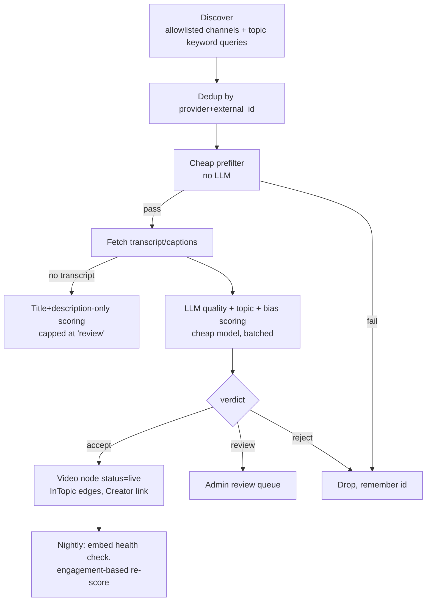

# 04 — Curation Mode (external videos)

Find, vet, and **embed** high-quality short educational videos from other platforms.

## 1. Sources

| Provider | Discovery method | Playback | Notes |
|----------|-----------------|----------|-------|
| YouTube (Shorts + short regular videos) | Data API v3: channel uploads playlists for allowlisted channels; `search.list` with `videoDuration=short` by topic keywords | IFrame embed | Primary source. `search.list` costs 100 quota units vs 1 for `playlistItems.list` — prefer channel playlists |
| TikTok | oEmbed for URLs of allowlisted educational creators (manually/semiautomatically seeded) | TikTok embed | No open discovery API; treat as allowlist-only |
| Vimeo | API search / staff picks / channels | Vimeo embed | |
| TED / TED-Ed | YouTube channels | YouTube embed | |
| NASA, Smithsonian, PBS, Khan Academy, etc. | YouTube channels / own APIs | Embed | High-trust allowlist |
| Wikimedia Commons / Internet Archive | API, filter by license + duration | Direct `<video>` (PD/CC only) | Only case where hosting/proxying is allowed; keep attribution |

Instagram Reels: skip initially (restricted API, fragile embeds).

## 2. Pipeline



### 2.1 Prefilter (free)
- Duration ≤ 180 s (configurable; allow up to ~5 min for high-trust channels).
- Embeddable = true, not age-restricted, not "made for kids" conflicts, region allowed.
- Language in user-supported set.
- Title heuristics: reject ALL-CAPS/emoji spam, "you won't believe", reaction/compilation patterns.
- Creator trust ≥ threshold, or channel in allowlist, or view/like ratio sanity.
- Already-seen `external_id` → skip (store rejected ids to avoid re-scoring).

### 2.2 Transcript
- YouTube captions (official or auto) via `yt-dlp --skip-download --write-auto-subs` or the captions API. Metadata/captions only — **never download video**.
- Truncate to ~1,500 tokens (shorts are small anyway).

### 2.3 LLM scoring (byllm)

```jac
import from byllm.lib { Model }
glob scorer = Model(model_name="gpt-4o-mini");   # or Haiku / Gemini Flash — cheapest capable

sem QualityScore.density = "Useful facts or skills per minute, 0..1";
sem QualityScore.bias = "0 = balanced/neutral framing, 1 = one-sided advocacy";

def score_video(title: str, channel: str, transcript: str,
                taxonomy: list[str]) -> QualityScore by scorer();
```

- Batch multiple videos per call when the provider supports it; cache by `hash(transcript)`.
- Rubric: accuracy (no obvious errors), information density, clarity, low clickbait, on-taxonomy topic, not primarily entertainment/reaction/ads.
- Current-events videos: stricter — bias ≤ threshold, must cite or name sources, else `review`.
- Thresholds start conservative (prefer fewer, better videos); tuned from admin review outcomes.

### 2.4 Creator trust loop
Each accepted/rejected video updates `Creator.trust` (Bayesian average). High-trust creators get
auto-accepted with lighter scoring; low-trust stop being queried. This shrinks LLM spend over time.

## 3. Topic taxonomy (seed)

- **Current events** (world, science news, tech news, economy — bias-controlled)
- **Engineering** (civil, mechanical, electrical, software, aerospace, materials)
- **Science** (physics, chemistry, biology, earth/space, medicine)
- **History** (ancient, medieval, modern, military, history of science)
- **Linguistics & Languages** (etymology, phonetics, language learning micro-lessons)
- **Math & Logic**
- **DIY & Skills** (repair, woodworking, cooking technique, electronics, first aid)
- **Economics & Civics**, **Geography**, **Philosophy & Psychology (evidence-based)**

Stored as `Topic` nodes with `Parent` edges; the LLM must choose from these slugs (enforced by the typed output + validation).

## 4. Legal / ToS guardrails

- Embed via official players only; respect provider ToS (no ad-stripping, no re-hosting, attribution visible, link to original).
- YouTube API Services policies: display data freshly (refresh metadata ≤ 30 days), delete stored data for removed videos (nightly health check marks `dead`).
- Honour creator opt-out requests (a `Creator.blocked` flag).
- Store only metadata + our scores + transcript-derived summary (short), not full transcripts long-term if ToS disallows; decide per provider.
