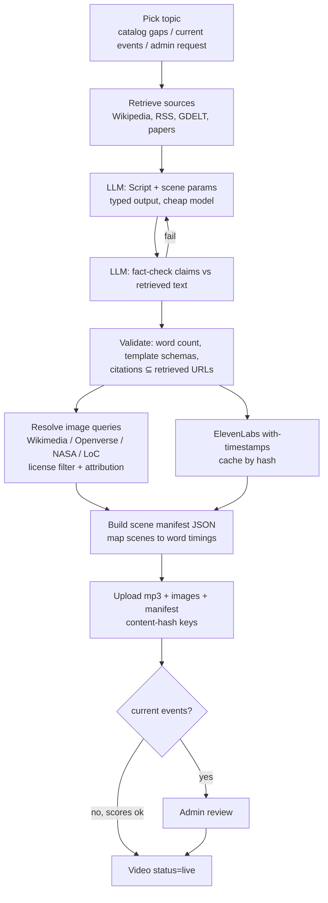

# 05 — Generation Mode (original videos)

Produce ~45–75 s narrated explainers from retrieved sources, ElevenLabs voice, public images, and
templated SVGs — rendered client-side from a scene manifest.

## 1. Pipeline



## 2. Topic selection

- **Evergreen gap filling**: per topic, if live videos < target or engagement shows demand > supply, pick sub-topics (LLM proposes from Wikipedia category trees / "Did you know" / curricula outlines; dedup against existing titles via embedding or normalised-title match).
- **Current events**: daily cluster stories from multiple outlets (see §5); only stories covered by ≥ 3 independent outlets across the spectrum qualify.
- **Admin / user requests**: `enqueue_generation` walker creates a `Job`.

## 3. Script generation (byllm)

```jac
sem Script.narration = "Spoken script, 130-170 words, plain language, one idea, no filler, hook in first sentence";
sem Scene.template = "One of: title_card, bullets, timeline, map_pin, comparison, bar_chart, process_flow, equation, labeled_diagram, quote, image_kenburns";
sem Scene.params = "Params matching the template's schema; text fields <= 60 chars";

def write_script(topic: str, sources: list[SourceDoc],
                 templates: dict[str, str]) -> Script by writer();
```

Rules enforced post-generation (code, not prompts):
- Word count within range → else one retry with feedback.
- Every `Scene.template` exists; `params` validated against its JSON schema; strings escaped.
- `citations` must be a subset of retrieved URLs (no hallucinated links).
- Scenes change every ~4–8 s (TikTok pacing); first scene = hook.

## 4. Fact-check pass

A separate call (can use a slightly stronger model for current events only):

```jac
obj ClaimCheck { has claim: str; has supported: bool; has source_url: str | None; has note: str; }
def check_claims(narration: str, sources: list[SourceDoc]) -> list[ClaimCheck] by checker();
```

Any unsupported claim → regenerate that sentence or drop it. Store the check result on the video
(visible via "Sources" sheet).

## 5. Bias control for current events

- **Source mix**: pull the same story from outlets spanning the spectrum plus wire services (AP, Reuters, AFP) and primary documents where possible. Maintain a `Source.lean` table from a published media-bias dataset (e.g. AllSides / Ad Fontes ratings — check licensing) for balancing, not for truth.
- **Claim-level writing**: script states facts agreed across sources; contested points are attributed ("X says…, Y disputes…"); no adjectives of judgement.
- **Automated bias score** (same `QualityScore.bias` rubric) must be below threshold.
- **Human review required** before publish; auto-expire after 7 days (configurable).
- Show "Sources (n outlets)" and publication date on the card.

## 6. Visuals — cheapest path first

Ordered by cost; the LLM only emits small param objects.

1. **SVG templates (default)** — hand-authored components in `client/scenes/` (title card, bullets, timeline, map pin on a world/region SVG, bar/line chart, comparison split, process flow, equation via KaTeX, quote, labeled diagram with numbered callouts). Params ≈ 20–80 output tokens per scene.
2. **Public images** — LLM outputs a *search query* (≈10 tokens); `services/images.jac` searches Wikimedia Commons / Openverse / NASA / LoC / Smithsonian Open Access, filters to PD / CC0 / CC-BY / CC-BY-SA, picks best by resolution + aspect, stores attribution. Rendered with Ken-Burns pan/zoom + optional SVG label overlays.
3. **Freeform LLM SVG (rare)** — only for a custom diagram no template covers; hard cap (e.g. 1,500 output tokens), sanitised (strip scripts, event handlers, external refs) with a strict allowlist sanitizer, cached forever.
4. **AI image generation** — not in v1 (cost + accuracy risk for educational content).

### Scene manifest (stored as JSON on CDN)

```json
{
  "version": 1,
  "audio": "https://cdn/.../a3f9.mp3",
  "duration_s": 58.2,
  "words": [["The", 0.00, 0.14], ["Roman", 0.14, 0.48], "..."],
  "scenes": [
    { "t": 0.0,  "template": "title_card", "params": { "title": "Why Roman concrete lasts", "kicker": "Engineering" } },
    { "t": 4.1,  "template": "image_kenburns", "params": { "src": "https://cdn/.../pantheon.webp", "from": [0.5,0.4,1.0], "to": [0.55,0.35,1.2], "credit": "Photo: X, CC BY-SA 4.0" } },
    { "t": 11.8, "template": "process_flow", "params": { "steps": ["Quicklime", "Hot mixing", "Lime clasts", "Self-healing"] } }
  ],
  "captions": "derived from words",
  "citations": ["https://..."],
  "attribution": ["..."]
}
```

`ScenePlayer` uses `audio.currentTime` + `requestAnimationFrame` to select the active scene and
highlight caption words. Scene `t` values are computed server-side from `Scene.start_word` →
ElevenLabs alignment (no LLM guessing of timestamps).

## 7. ElevenLabs integration

- Endpoint: `POST /v1/text-to-speech/{voice_id}/with-timestamps` → base64 audio + character alignment; convert to word timings.
- Model: cheapest acceptable (Flash/Turbo tier) for bulk; a higher-quality model only for featured videos. Verify current per-character pricing/credits at build time.
- A small fixed roster of voices (e.g. 3–4) mapped to categories for brand consistency.
- Cache key: `sha256(model + voice + normalised_text)` → never pay twice for the same audio.
- Output `mp3_44100_64` (small, sufficient for speech).
- Text normalisation before TTS (numbers, units, abbreviations, IPA hints for linguistics content via SSML-like phoneme tags where supported).
- Retry with backoff on 429; respect concurrency limit of the plan.

## 8. Optional MP4 export

`scripts/export_mp4.py`: headless browser (Playwright) records the `ScenePlayer` at 1080×1920 or
renders frames → ffmpeg mux with the mp3. Only run on demand (share/download), cached by manifest
hash. Not in the hot path.
